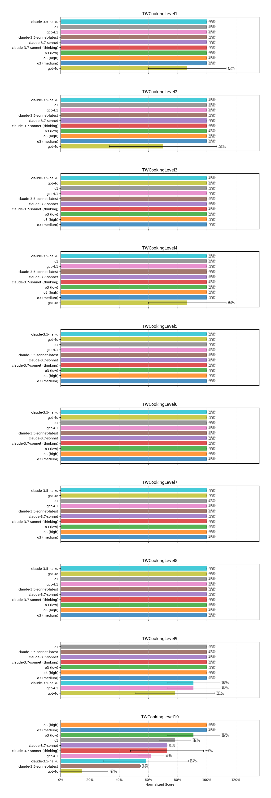
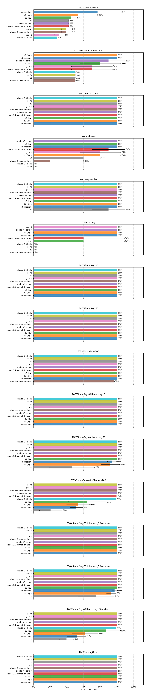

<link rel="stylesheet" href="https://cdnjs.cloudflare.com/ajax/libs/font-awesome/6.4.0/css/all.min.css">

    

        <button class="tab-button active" onclick="openTab(event, 'tab6')">Leaderboard</button>
        <button class="tab-button" onclick="openTab(event, 'tab1')"><strong><em>TALES</em></strong></button>
        <button class="tab-button" onclick="openTab(event, 'tab4')">Environments</button>
        <button class="tab-button" onclick="openTab(event, 'tab3')">Scores By Framework</button>
        <button class="tab-button" onclick="openTab(event, 'tab2')">Scores By Game</button>
        <!-- <button class="tab-button" onclick="openTab(event, 'tab5')">Bloopers</button> -->
    

    <!-- Content for main tab without nested tabs -->
     

    
Abstract

    
Reasoning is an essential skill to enable Large Language Models (LLMs) to interact with the world. As tasks become more complex, they demand increasingly sophisticated and diverse reasoning capabilities for sequential decision-making, requiring structured reasoning over the context history to determine the next best action.
    We introduce <strong><em>TALES</em></strong>, a diverse collection of synthetic and human-written text-adventure games designed to challenge and evaluate diverse reasoning capabilities.
    We present results over a range of LLMs, open- and closed-weights, performing a qualitative analysis on the top performing models.
    Despite an impressive showing on synthetic games, even the top LLM-driven agents fail to achieve 12% on games designed for human enjoyment

    <!-- <video controls autoplay muted loop width="100%" poster="assets/figs/figure1_eric.png">
        <source src="assets/videos/figure1v4.mp4" type="video/mp4">
        
        Your browser does not support the video tag.
    </video> -->
    
    
An example of an agent playing through a text-adventure game. Thought traces are fabricated for illustration. For text-adventure games, due to their length and the variety of puzzles required for progression, players must make use of a range of different reasoning skills to solve roadblocks and continue through the game. Because of the long-range, causal dependencies often found in these games, a single mistake at any step can lead to a breakdown in gameplay later on.

<!-- Nested tabs for tab2 -->

    <button class="nested-tab-button active" onclick="openNestedTab(event, 'tab2-subtab1')">Textworld</button>
    <button class="nested-tab-button" onclick="openNestedTab(event, 'tab2-subtab2')">Textworld Express</button>
    <button class="nested-tab-button" onclick="openNestedTab(event, 'tab2-subtab3')">Alfworld</button>
    <button class="nested-tab-button" onclick="openNestedTab(event, 'tab2-subtab4')">Scienceworld</button>
    <button class="nested-tab-button" onclick="openNestedTab(event, 'tab2-subtab5')">Jericho</button>

    <h2 id="tw_all_games">Scores for all Textworld games for Top 10 models</h2>
    

    <h2 id="twx_all_games">Scores for all Textworld Express games for Top 10 models</h2>
    

    <h2 id="alfworld_all_games">Scores for all Alfworld games for Top 10 models</h2>
    

    <h2 id="scienceworld_all_games">Scores for all Scienceworld games for Top 10 models</h2>
    

    <h2 id="jericho_all_games">Scores for all Jericho games for Top 10 models</h2>
    

    <!-- Insert Tab 3 content here -->
    <h2>Breakdown of scores per framework</h2>
    

Please consider citing the original work!

    

        <button class="nested-tab-button" onclick="openNestedTab(event, 'tab4-subtab1')">Textworld</button>
        <button class="nested-tab-button" onclick="openNestedTab(event, 'tab4-subtab2')">Textworld Express</button>
        <button class="nested-tab-button" onclick="openNestedTab(event, 'tab4-subtab3')">Alfworld</button>
        <button class="nested-tab-button" onclick="openNestedTab(event, 'tab4-subtab4')">Scienceworld</button>
        <button class="nested-tab-button active" onclick="openNestedTab(event, 'tab4-subtab5')">Jericho</button>
    

    

        

            <a href="https://github.com/microsoft/TextWorld">TextWorld</a>
            <button class="cite-button" onclick="copyTextToClipboard('textworld-citation', event)">
    <i class="fa fa-copy"></i>
</button>
            @Article{cote18textworld,
  author = {Marc-Alexandre C\^ot\'e and
            \'Akos K\'ad\'ar and
            Xingdi Yuan and
            Ben Kybartas and
            Tavian Barnes and
            Emery Fine and
            James Moore and
            Ruo Yu Tao and
            Matthew Hausknecht and
            Layla El Asri and
            Mahmoud Adada and
            Wendy Tay and
            Adam Trischler},
  title = {TextWorld: A Learning Environment for Text-based Games},
  journal = {CoRR},
  volume = {abs/1806.11532},
  year = {2018}
}
        

        

        
        

        
TextWorld is a framework originally designed for training agents with Reinforcement Learning on text-based games. It can generate synthetic text-adventure games of varying complexity. In TALES, we integrate the "CookingWorld" games that were used as part of the <a href="https://competitions.codalab.org/competitions/21557">NeurIPS 2018 Competition</a>. The task involves following a recipe that requires finding ingredients and processing them according to said recipe. We selected one game per difficulty ranging from level 1 (with one location and a recipe of 1 ingredient) to level 10 (having 12 locations and a recipe with 3 ingredients). For all difficulties, the player receives 1 point after completing sub-goals related to the task in the game. Difficulty level 1 can be solved in 7 moves with a max score of 3, while level 10 requires 44 moves with a max score of 11.

    

    

        
<a href="https://github.com/cognitiveailab/TextWorldExpress">Textworld Express</a>
        <button class="cite-button" onclick="copyTextToClipboard('textworld_express-citation', event)">
    <i class="fa fa-copy"></i>
</button>
            @article{jansen2022textworldexpress,
  url = {https://arxiv.org/abs/2208.01174},
  author = {Jansen, Peter A. and Côté, Marc-Alexandre},
  title = {TextWorldExpress: Simulating Text Games at One Million Steps Per Second},
  journal = {arXiv},
  year = {2022},
}

        

        
        <figcaption class="image-caption">Generated by GPT-4o.</figcaption>
    

        
Textworld Express is a highly optimized re-implementation of many Textworld game scenarios that runs approximately three orders of magnitudes faster compared to the Textworld counterparts.
        While token throughput is the major speed bottleneck in many LLM-based applications, we opt to use Textworld Express over Textworld for the performance improvement where applicable.

        While significantly faster, an arguable drawback of using Textworld Express over Textworld is also in its stricter parser.
        Textworld Express simplifies its parser for speed and thus does not allow for nearest-neighbor action phrases.

    

    

        
<a href="https://alfworld.github.io/">Alfworld</a>
        <button class="cite-button" onclick="copyTextToClipboard('alfworld-citation', event)">
    <i class="fa fa-copy"></i>
</button>
            @inproceedings{ALFWorld20,
  title ={ALFWorld: Aligning Text and Embodied
           Environments for Interactive Learning},
  author={Mohit Shridhar and Xingdi Yuan and
          Marc-Alexandre C\^ot\'e and Yonatan Bisk and
          Adam Trischler and Matthew Hausknecht},
  booktitle = {Proceedings of the International Conference on Learning Representations (ICLR)},
  year = {2021},
  url = {https://arxiv.org/abs/2010.03768},
}

        

        
        <figcaption class="image-caption">For TALES, we only make use of the text modality.</figcaption>
    

        
Alfworld is a multi-modal framework combining complementary visual and textual observations, where agents are asked to navigate and perform tasks in a household setting. All tasks provide only a terminal reward of 1 upon task completion. For <strong><em>TALES</em></strong>, we only use its textual modality as it has become the standard in the LLM literature when evaluated on.

        
The Alfworld environments are unique in their lack of informative feedback.
        Where other environments have a predefined error message relating to the type of error, whether it is due to the parser not recognizing the command or the action not being possible, Alfworld has only one error message in the form of 'Nothing happened'.
        In the original Alfworld framework, the visual component compensates for the insufficient text feedback. However, this lack of detailed information significantly increases the difficulty for agents that rely solely on text-based interactions.
        This difficulty is compounded upon by the limitation that an agent in Alfworld can only hold one object at a time. 

    

    

        
<a href="https://github.com/allenai/ScienceWorld">Scienceworld</a>
        <button class="cite-button" onclick="copyTextToClipboard('scienceworld-citation', event)">
    <i class="fa fa-copy"></i>
</button>
            @misc{scienceworld2022,
    title={ScienceWorld: Is your Agent Smarter than a 5th Grader?},
    author={Ruoyao Wang and Peter Jansen and Marc-Alexandre C{\^o}t{\'e} and Prithviraj Ammanabrolu},
    year={2022},
    eprint={2203.07540},
    archivePrefix={arXiv},
    primaryClass={cs.CL},
    url={https://arxiv.org/abs/2203.07540}
}

        
    

        
Scienceworld is a framework focused on the completion of elementary-level science curriculum tasks.
        Notably for many of its tasks, Scienceworld emulates an open-world setting where the player can complete the task in different ways that do not follow one expected trajectory.
        When it comes to heating objects, this part of the task can be completed by either the oven in the kitchen or the blast furnace in the workshop.
        Similarly, Scienceworld also allows the player the freedom to reset the game on command.
        This is especially important as a number of Scienceworld games have dead states where it is no longer possible to complete the assigned task in that play-through.

    

    

        
<a href="https://github.com/microsoft/jericho">Jericho</a>
        <button class="cite-button" onclick="copyTextToClipboard('jericho-citation', event)">
    <i class="fa fa-copy"></i>
</button>
            @article{hausknecht19,
  title={Interactive Fiction Games: A Colossal Adventure},
  author={Hausknecht, Matthew and Ammanabrolu, Prithviraj and C\^ot\'{e} Marc-Alexandre and Yuan Xingdi},
  journal={CoRR},
  year={2019},
  url={http://arxiv.org/abs/1909.05398},
  volume={abs/1909.05398}
}

        
    

        
Jericho is a suite of 55 human-written, interactive fiction games.
        We consider Jericho to be the most difficult framework due to the length and complexity of many of the games. Some can be completed within 17 steps while some others require over 500 steps.
        Those games also cover an extremely wide range of genres and styles and lack the consistency of many other text-game environment suites designed for evaluating agents.
        For example, '9:05' follows the morning of an ordinary office worker where 'Anchorhead' is a Lovecraftian Horror Story.

    

    

        
Below is an interactive version of Zork I, one of the classic text adventure games available in the Jericho suite:

        <iframe src="https://iplayif.com/?story=https%3A%2F%2Fgithub.com%2FBYU-PCCL%2Fz-machine-games%2Fraw%2Frefs%2Fheads%2Fmaster%2Fjericho-game-suite%2Fzork1.z5" width="100%" height="600px" frameborder="0" title="Play Zork I"></iframe>
        
<em>Try it yourself! Type commands like "look", "inventory", or "go north" to interact with the game.</em>

    

    <!-- Insert Tab 5 content here -->
    <h2></h2>
    
Funny LLM Fails to be added here.

    <!-- Insert Tab 5 content here -->
    
All LLM Scores can be found below. For the graphs in other visualizations, we used only the top 10 models. All scores are displayed as percentages.

    

        <button class="nested-tab-button active" onclick="openNestedTab(event, 'tab6-subtab1')">Overview</button>
        <button class="nested-tab-button" onclick="openNestedTab(event, 'tab6-subtab2')">Per Framework</button>
    

    

        
    

    

        
    

